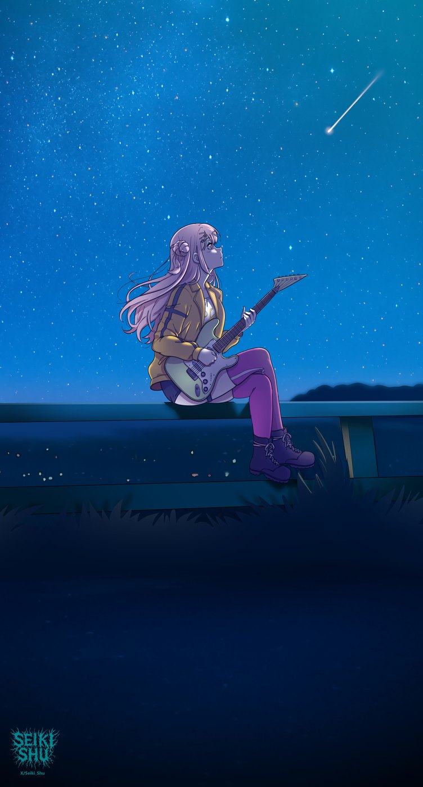
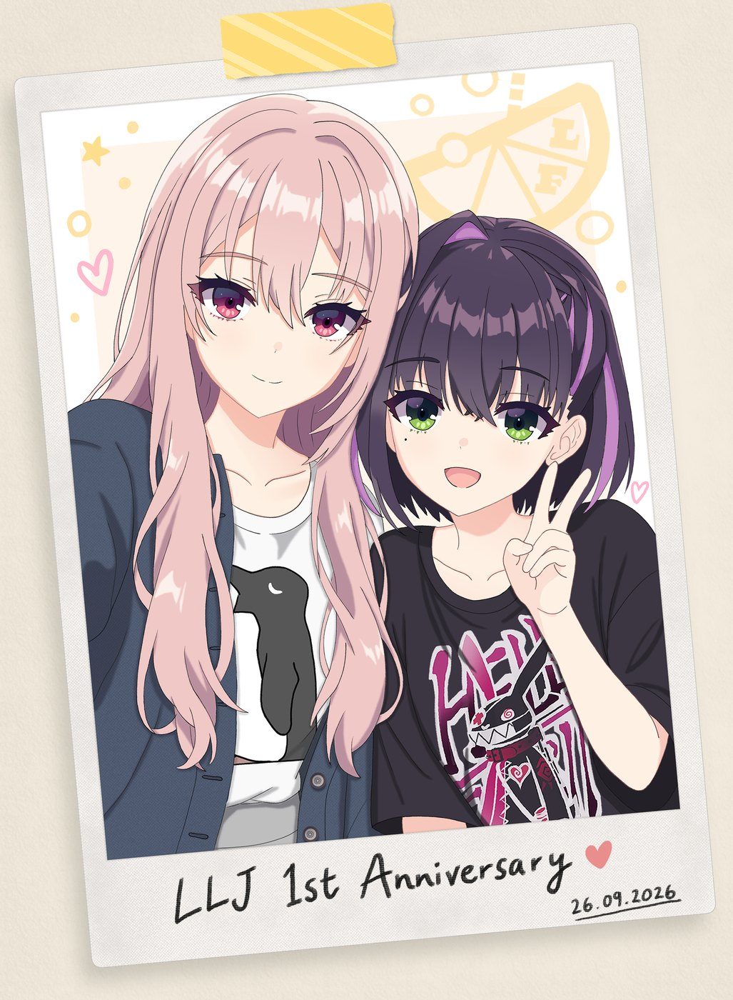

今天在 xhh 上偶然刷到一个评价柚子社 Yuzusoft gal 作品的文章，评分最高的就是 **《LimeLight Lemonade Jam》**（聚光灯下的柠檬恋曲）。

由于中秋节才找了**千恋万花**的资源，算是偶然乘兴吧，我把**柚子社的合集**全保存下来了，而且直接在今天爽玩 Lemonade！

## 一、从 9nine 到 Lemonade

之前玩过一段时间 **9nine 系列**，因为觉得剧情太无聊就没玩 gal 了。但是，今天玩的 Lemonade 倒是让我感觉有点兴趣。

**主题是乐队**——还行，我只看过《孤独摇滚》（也不怎么感冒）。不过这部 gal 的**画风我很喜欢**，看起来很舒服；在共通主线内还有一段**高质量 CG**，就像是在看一部乐队番的演奏场景，着实让我有点惊讶了。柚子社的**背景音乐**都还行，这部依旧稳定发挥。

## 二、手推几小时，卡在寝室

我目前手推了几个小时，刚到第一条角色线（**阳见惠凪**）第二章。由于是在寝室，一到关键 CG 就没玩了 😂

后面发现 **Kr 资源有全存档**，就好好欣赏了一波——

> 一个字，享受！

## 三、惠凪，完全符合我 xp 的女人

欣赏完所有 CG 后，我最喜欢的角色还是**惠凪**——简直是完全符合我 xp 的女人啊！😫😫😫

## 四、接下来

后面我应该还会过一过具体的剧情，应该还有值得我游玩的地方。

