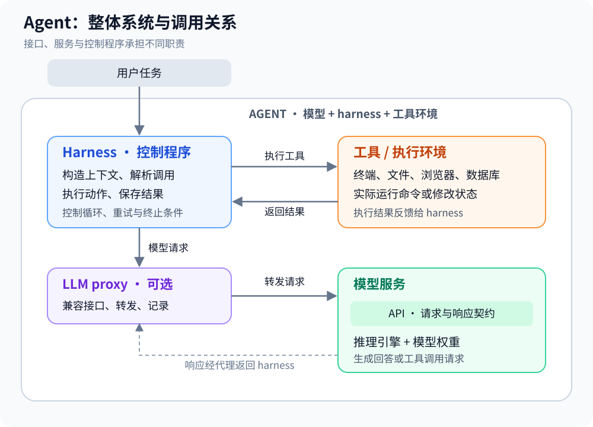
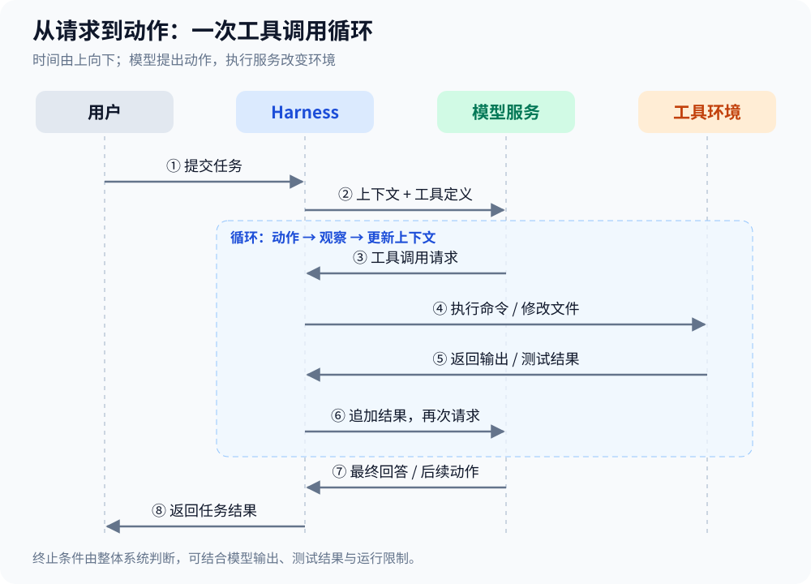
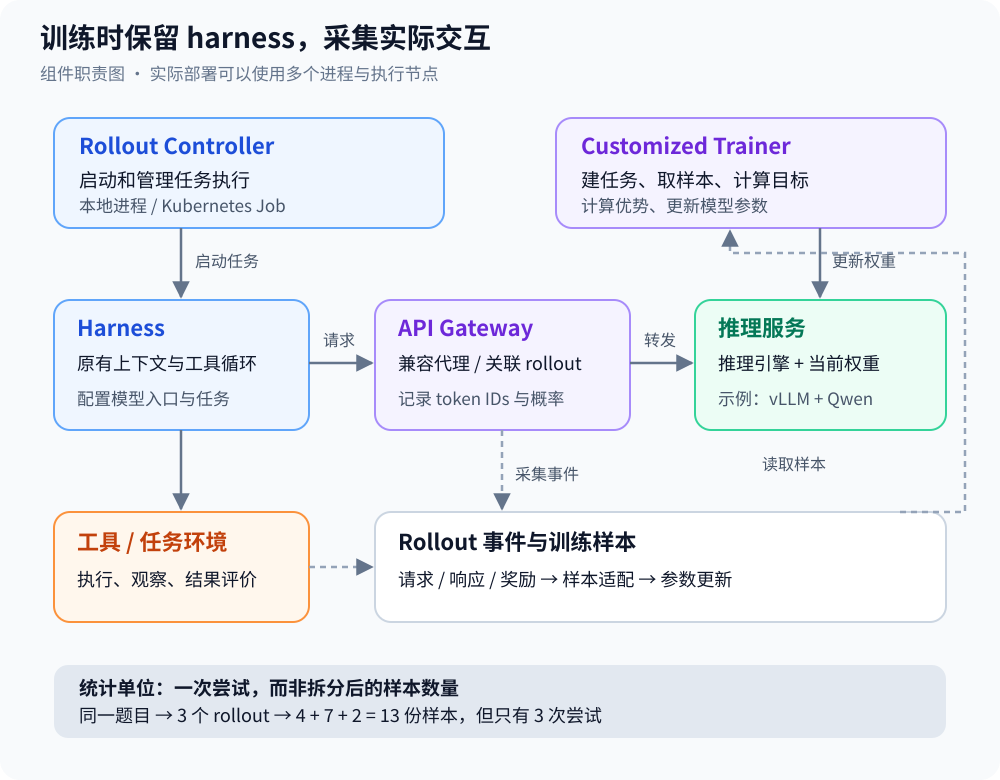

> 📝 本篇是 AI 辅助整理的复习笔记。
> **主题**：生成式界面、决策路由、Agent 架构与强化学习
> **对话日期**：2026-10-08　|　**资料范围**：`AI_HOT_日报_·_2026-10-08.txt`

## 目录

- [一、学习笔记](#一学习笔记)
  - [1. 基础概念与层次关系](#1-基础概念与层次关系)
  - [2. Agent 的工具调用循环](#2-agent-的工具调用循环)
  - [3. Intelligent UI：把回答变成界面](#3-intelligent-ui把回答变成界面)
  - [4. Decisions API：系统中的判断环节](#4-decisions-api系统中的判断环节)
  - [5. Agent Lightning：用实际 harness 参与训练](#5-agent-lightning用实际-harness-参与训练)
  - [6. 代码视角与配置字段](#6-代码视角与配置字段)
  - [7. 复习卡片](#7-复习卡片)
- [二、每日日报](#二每日日报)
- [三、资料与核实状态](#三资料与核实状态)

---

## 一、学习笔记

### 1. 基础概念与层次关系

#### 1.1 五个核心概念

| 概念 | 定义 | 在系统中的职责 |
|---|---|---|
| **大模型（LLM）** | **通过训练得到的参数，在推理引擎中根据输入生成输出。** | 理解输入、生成内容、提出工具调用或下一步动作 |
| **大模型 API** | **调用模型服务的接口契约，包含请求格式、响应格式、鉴权及网络端点。** | 为客户端提供模型服务入口 |
| **LLM 代理（proxy）** | **位于客户端与模型服务之间的转发程序。** | 转发请求，并可记录日志、路由请求或收集训练数据 |
| **Harness** | **围绕模型运行的控制程序，负责上下文管理、工具执行、错误处理和任务循环。** | 组织任务、执行动作、记录结果、控制运行过程 |
| **Agent（智能体）** | **模型、harness 与工具环境组成的任务执行系统。** | 根据目标进行多步决策、执行与反馈 |

> ⚠️ **这五个词不是同一种"层级"**：Agent 是整体称呼；模型、harness 和工具环境是它的组成部分；API 是接口，proxy 是中间服务。



*图 1 · 蓝色表示控制程序，紫色表示代理，绿色表示推理服务，橙色表示工具环境；箭头区分模型调用与工具执行。*

#### 1.2 模型、API 与 App

**App 是用户使用的产品界面；API 是程序调用服务的接口；模型是完成推理和生成的核心。** 发布新模型与发布新界面功能是不同的变化，可以同时发生。

以学习用的简化链路表示：

```text
用户 → App / harness → API → 推理服务中的模型
```

> ⚠️ 实际产品可能还有路由、鉴权、缓存等服务，**不能把简化图当作完整部署拓扑**。

#### 1.3 输入、上下文与"记忆"

> **上下文（context）**：本次推理可使用的信息，包括系统提示、任务、历史消息和工具返回结果。

**无状态推理**指常见模型调用不会自动把上一轮对话作为新一轮输入。多轮连续性通常由**客户端或服务端会话层**保存历史，再构造下一次上下文；**模型参数不会因为聊了一次就自动更新**。

常见 Chat Completions 写法会重复发送 `messages`，但"每轮必须发送全部历史"并非所有 API 的通用要求。历史可以被裁剪、摘要，或由服务端会话机制管理。

**上下文窗口**是一次推理可容纳的 token 数量上限。实际费用通常与发送和生成的 token 数、缓存命中及服务定价有关；💡 **窗口上限更大并不等于每次费用必然更高**。

#### 1.4 Token 与概率

- **Token**：分词器处理文本等输入时使用的基本单位；token ID 是其词表编号。**Token 不一定对应一个字或一个单词**，中文字符与 token 的比例取决于具体分词器。
- **Tokenizer（分词器）**：负责将文本与 token 序列相互转换。
- **Chat template（聊天模板）**：把消息角色和内容组织成模型接收的格式。
- **Log probability / logprobs**：token 概率的对数。在策略梯度类训练中，token 序列与对应概率信息用于构造训练目标；⚠️ **它不是整段答案正确率**。
- **Temperature（采样温度）**：调节生成时概率分布的集中程度。较高通常增加随机性，较低通常让输出更集中。
- **置信度**：系统对某项判断给出的分数。⚠️ 未经校准的分数不能直接等同于真实正确率，阈值需要结合实际验证集确定。

### 2. Agent 的工具调用循环

**ReAct 是把推理、动作和环境观察结合起来的 Agent 运行方式。** 在工具调用场景中，可简化为"**构造上下文 → 模型提出动作 → 执行工具 → 反馈结果 → 下一轮**"。



*图 2 · 模型提出调用；harness 或其连接的执行服务实施调用；工具结果进入下一轮上下文。*

修复失败测试的典型过程：

| 步骤 | 执行方 | 行为 |
|---|---|---|
| 1 | Harness | 接收任务，载入项目说明和失败日志 |
| 2 | Harness → 模型服务 | 发送上下文和工具定义 |
| 3 | 模型 | 生成运行 `pytest tests/test_login.py -x` 的工具调用 |
| 4 | Harness / 执行服务 | 运行命令，获取输出 |
| 5 | Harness | 将测试输出写入上下文 |
| 6 | 模型 | 根据结果提出文件修改 |
| 7 | Harness / 执行服务 | 修改文件，再次运行测试 |
| 8 | Harness 与模型 | 根据结果继续处理或结束任务 |

> **工具定义（`tools`）** 描述可调用工具的名称、参数和用途；
> **工具调用（`tool_calls`）** 是模型生成的调用请求；
> **工具执行**才产生实际环境变化。

⚠️ `finish_reason` 是生成结束原因之一，**不是任务已经成功的完整证明**。任务终止还可取决于测试结果、步数限制、超时、错误与业务规则。

### 3. Intelligent UI：把回答变成界面

> **生成式界面（Generative UI）**：根据用户需求动态生成或组合界面组件的交互方式。对话中的 Intelligent UI 属于这一方向。

**流式输出（streaming）**是结果尚未全部生成时，就持续发送已经生成的部分。流式界面还需要渲染端逐步接收并展示可用的组件结构。

| 需求 | 可采用的界面形式 | 交互价值 |
|---|---|---|
| 三人聚餐分账 | 金额输入框、人数选项、计算结果 | 修改输入后重新计算 |
| 手机参数比较 | 可排序表格、比较图 | 从多个维度检查差异 |
| 学习注意力机制 | 参数滑块、动态曲线或关系图 | 观察参数变化带来的结果 |

**结构化输出**是按约定字段与数据类型生成的结果，例如 JSON 或组件描述。程序能直接读取字段，但**仍需进行格式、类型和内容校验**。

实现难点包括：

- 组件结构的生成
- 流式过程中的增量渲染
- 交互状态管理
- 可复现性、无障碍访问和视觉一致性

💡 动态界面可降低部分小工具的制作成本，但复杂产品仍有业务逻辑、维护和质量要求。

> 📌 对话提及 GPT-6 的 `Sol`、`Luna`、`Instant`、`Astra` 分档，以及联网问题首字等待时间下降约 44%。**这些属于原对话的产品与性能描述**，核实状态见第三部分。

### 4. Decisions API：系统中的判断环节

> **决策 / 路由（routing）**：在执行主要任务之前或过程中，选择类别、模型、工具、子智能体或下一步动作。

> **延迟（latency）**：完成某个请求或阶段所需的时间。
> **关键路径**：决定任务最早完成时间的依赖链。
> ⚠️ 路由如果位于关键路径，其耗时会**直接影响后续响应开始的时间**。

| 路由方式 | 主要优势 | 主要代价 |
|---|---|---|
| 通用模型判断 | 可用自然语言定义复杂规则 | 调用耗时、成本和结果解析 |
| 专门分类器 | 在合适场景下响应快、输出稳定 | 数据标注、训练与规则变更成本 |
| 决策专用服务 | 面向判断任务提供接口和结构化结果 | 具体能力、延迟与价格依赖服务实现 |

原对话将 Decisions API 的输出分为三类：

| 类型 | 含义 | 示例 |
|---|---|---|
| **断言（Predicate）** | **判断某个条件是否成立，可附带分数。** | 是否涉及医疗建议 |
| **选择（Choice）** | **从给定候选项中选出结果。** | 退款 / 换货 / 技术故障 |
| **评分（Score）** | **按指定尺度给出数值。** | 风险 0–10、优先级 1–5 |

**应用场景**：简单问题与复杂问题的模型分流、工具选择、工单分类、内容风险标记和优先级排序。

```text
请求 → 决策服务 → 类别 / 模型 / 工具 / 优先级 → 实际执行
```

> ⚠️ 原对话提及独立端点 `/v1/decisions`、GPT-6 Luna、约 150ms、最高快 10 倍及多模态输入。上述细节来自原对话所称的**二手资料，不能作为已核实的接口规范**。路由节省多少费用、专用接口为何更快，需要结合具体实现和测量，**不能仅由接口名称推导**。

### 5. Agent Lightning：用实际 harness 参与训练

#### 5.1 强化学习基础

| 概念 | 定义与用途 |
|---|---|
| **强化学习（RL）** | **通过与环境交互、获取奖励并更新策略，使系统更倾向于获得高奖励的行为。** 奖励仍可能依赖人工规则、测试或人工反馈 |
| **策略（policy）** | **给定状态或上下文时，产生动作的规则或概率分布。** 在此场景中，模型生成行为是策略的一部分 |
| **Reward（奖励）** | **评价一次行为或任务结果的反馈信号。** 例如测试通过得 1、失败得 0 |
| **Rollout** | **在一个任务上按照当前策略进行的一次完整尝试。** |
| **Trajectory（轨迹）** | **一次尝试过程中形成的状态、动作与反馈记录。** |
| **Training example / sample** | **训练器消费的输入单元。** 一个 rollout 可能拆成多个样本 |
| **Advantage（优势值）** | **某次行为或尝试的收益相对于参考基线的高低。** |
| **Loss（损失）** | **训练时用于计算参数更新方向的目标函数。** |
| **GRPO** | **通过同一题目的多次尝试进行组内奖励比较的一类策略优化方法。** |
| **Kubernetes Job** | **用于管理执行到完成的批处理任务的集群资源。** 可承载 rollout 的执行任务 |

💡 **SWE-bench Verified** 是基于真实软件仓库问题的编程评测集；**Pass@1** 表示单次尝试的成功率或其估计。

#### 5.2 核心问题与方案

训练系统如果重写已有 harness 的交互循环，就需要重新实现**上下文压缩、工具协议、执行逻辑、错误处理及依赖管理**。重写后的行为可能与部署时不同，增加适配成本与训练偏差。

> **Harnessed Agentic RL 的核心思路**：保留已有 harness 的执行方式，通过兼容的 **LLM proxy 采集模型交互**，让实际使用的 harness 参与训练。

⚠️ "零代码改动"主要指**兼容 harness 的模型调用与循环代码可保持原状**；仍需配置模型端点、训练后端、任务执行环境及奖励上报等环节。



*图 3 · 实线表示模型调用与执行控制，虚线表示事件收集；Trainer 更新模型参数，Controller 管理任务运行。图中的组件不等于固定的进程数量。*

| 组件 | 职责 |
|---|---|
| **API Gateway** | **提供兼容接口，转发模型请求，关联 rollout 并记录训练事件。** |
| **Rollout Controller** | **启动、跟踪和管理 harness 的运行。** 可使用本地进程或 Kubernetes Job |
| **Customized Trainer** | **创建 rollout、收集事件、组装样本、计算训练目标并更新策略。** 原对话描述其基于 verl |
| **推理服务** | **加载当前模型权重并处理生成请求。** 原对话以 vLLM 为例 |

#### 5.3 四个技术难点

| 难点 | 成因 | 处理原则 |
|---|---|---|
| **重新分词漂移（Retokenization drift）** | **文本重新应用聊天模板和分词器后，可能无法还原实际采样的 token 序列。** | 保存真实 token IDs；仅在 token 历史严格连续时合并相邻调用 |
| **优势值统计偏差** | **一个 rollout 被拆为多份样本后，按样本统计可能重复计入同一次尝试。** | 在 rollout 层计算优势，再传给其各个样本 |
| **Loss 权重偏差** | **样本拆分数量可能影响一次尝试在更新中的权重。** | 先明确每个 rollout 内部如何汇总，再按 rollout 层归一化 |
| **动态训练负载调度** | **运行完成后才能确定样本数量与长度，而训练资源和并行配置有约束。** | 在样本适配、批处理及训练后端中安排动态负载；K8s 主要解决执行任务的调度 |

⚠️ **K8s 调度 rollout 与 GPU 训练样本调度是相关但不同的问题**，不能把第四个难点简单等同于"交给 K8s"。

拆分样本与尝试次数的关系：

| 同一训练题目 | 拆分后的样本数 | 统计上的尝试次数 |
|---|---:|---:|
| Rollout A | 4 | 1 |
| Rollout B | 7 | 1 |
| Rollout C | 2 | 1 |
| 合计 | 13 | 3 |

> **13 份样本并不代表 13 次独立尝试**；同一 rollout 的样本共享其任务奖励与 rollout 层优势。

#### 5.4 训练循环

1. 注册当前模型推理端点。
2. 为每个任务创建一个或多个 rollout。
3. Controller 启动 harness，等待尝试完成。
4. 从 Gateway 收集模型请求、响应、奖励及诊断事件。
5. 将记录转换为训练样本，处理 token 连续性和归一化。
6. 计算优势、更新策略，再进入下一轮。

💡 **参数更新发生在训练器中**；harness 的主要作用仍是组织和执行任务。Gateway 采集数据并不意味着仅凭转发请求就能完成训练。

> 📌 原对话报告：框架约 **3,500 行代码**，使用约 **6,000 条训练样本**，Qwen3.5-9B 的 SWE-bench Verified Pass@1 从 **41.8%** 提升到 **56.4%**。

**百分点表示两个百分比的直接差值**：此处为 `56.4 − 41.8 = 14.6` 个百分点；相对提升约为 `14.6 / 41.8 ≈ 34.9%`。⚠️ 这是原对话记录的实验结果，**不代表其他模型和任务必然获得相同提升**。

### 6. 代码视角与配置字段

#### 6.1 请求字段与角色对应

| 字段 / 配置 | 对应概念 | 作用 |
|---|---|---|
| `base_url` | **服务入口** | 指向厂商服务或代理服务 |
| `api_key` | **鉴权凭据** | 由接收请求的服务校验 |
| `model` | **模型选择标识** | 由服务端映射到可用模型或权重 |
| `messages` | **本次上下文** | 角色、任务、历史与工具结果 |
| `tools` | **工具接口描述** | 提供工具名称、参数结构和用途 |
| `tool_calls` | **动作请求** | 指明希望调用的工具及参数 |
| `finish_reason` | **生成结束原因** | 用作循环控制信息之一 |
| `temperature` | **采样随机性设置** | 影响生成分布；代理可按配置覆盖 |
| `logprobs` / token IDs | **训练相关记录** | 保存实际采样信息，支持样本构建 |
| `rollout_id` / `attempt_id` | **任务记录标识** | 将调用关联到具体尝试 |
| `reward` event | **任务评价反馈** | 为策略更新提供奖励信号 |

⚠️ **`base_url` 选择服务入口，`model` 选择该服务支持的模型** —— 两者概念上不同，但只能组合服务实际支持的模型与接口。更换 `base_url` 不保证兼容所有字段；更换 `model` 也不保证工具能力和行为不变。

#### 6.2 最小工具循环（教学示意）

以下代码用于观察**上下文、工具调用与循环**的关系。`execute`、`TOOLS`、`SYSTEM_PROMPT` 及配置由具体应用提供。

```python
import json
from openai import OpenAI

client = OpenAI(base_url=BASE_URL, api_key=API_KEY)

def run(task: str) -> str:
    messages = [
        {"role": "system", "content": SYSTEM_PROMPT},
        {"role": "user", "content": task},
    ]

    for _ in range(20):
        response = client.chat.completions.create(
            model=MODEL_NAME,
            messages=messages,
            tools=TOOLS,
        )
        message = response.choices[0].message
        messages.append(message.model_dump(exclude_none=True))

        if not message.tool_calls:
            return message.content or ""

        for call in message.tool_calls:
            arguments = json.loads(call.function.arguments)
            result = execute(call.function.name, arguments)
            messages.append({
                "role": "tool",
                "tool_call_id": call.id,
                "content": str(result)[:8000],
            })

    raise RuntimeError("Maximum tool-call rounds exceeded")
```

| 代码位置 | 职责 |
|---|---|
| `messages` | 保存并构造上下文 |
| `for` 循环 | 控制多轮交互及步数上限 |
| `create(...)` | 请求模型生成 |
| `execute(...)` | 真正调用工具 |
| `messages.append(...)` | 将动作和观察写入下一轮上下文 |
| `[:8000]` | 按字符简单截断；**不等于摘要，也不等于 token 预算管理** |

💡 更完整的 harness 还会处理**上下文摘要、工具异常、重试、子智能体、权限规则及会话资源复用**。

#### 6.3 代理入口与服务配置

原对话记录的直接调用入口示例：

```python
BASE_URL = "https://api.openai.com/v1"
```

原对话记录的 Agent Lightning 训练代理入口：

```python
BASE_URL = (
    f"http://127.0.0.1:8181"
    f"/proxy/rollout/{rollout_id}"
    f"/attempt/{attempt_id}/mode/train/openai/v1"
)
client = OpenAI(base_url=BASE_URL, api_key=AGL_KEY)
```

对应的请求路径：

```text
POST /proxy/rollout/{rollout_id}/attempt/{attempt_id}/mode/train/openai/v1/chat/completions
```

💡 **路径中的 rollout 标识将模型调用关联到任务**；`mode/train` 与 `mode/val` 用来区分训练和验证请求。接口兼容性使现有客户端能够沿用常规调用方式。

原对话记录的配置摘录：

```yaml
host: 0.0.0.0
port: 8080
key: ""
default_proxy:
  model_name: "Qwen/Qwen2.5-7B-Instruct"
  include_log_probs: true
  train: { temperature: 1 }
  val: { temperature: 0.7 }
```

> ⚠️ 原对话注明：三方使用同一个非空 key，模型名需要匹配训练后端配置；示例 `key: ""` 是**待配置值**。默认配置端口为 8080，Quick Start 示例为 8181；配置摘录中的 Qwen2.5-7B 与实验中的 Qwen3.5-9B 也是不同示例。

**具体路径、端口、字段和温度属于版本配置，不能由概念图直接确定。**

#### 6.4 事件与样本处理（示意）

事件表示采用有效 JSON 示例；字段结构仍属于**教学示意，不能作为真实 API schema**：

```json
{
  "rollout_id": "r-0007",
  "kind": "model_request",
  "prompt_token_ids": [151644, 8948, 198],
  "response_token_ids": [11, 440, 6354],
  "chosen_token_logprobs": [-0.42, -2.11, -0.08],
  "temperature": 1.0
}
```

一个 rollout 的记录可包含多次模型调用、任务奖励和自定义诊断事件。原对话给出的状态示例为：

```text
QUEUING → RUNNING → SUCCEEDED / FAILED
```

> **连续性检查的原则**：后一请求的 token 历史应与前一请求及响应**严格连续**，才适合合并。

```python
# 概念示意，不是官方实现
previous_history = previous.prompt_ids + previous.response_ids
is_continuous = (
    current.prompt_ids[:len(previous_history)] == previous_history
)
if is_continuous:
    merge_calls(previous, current)
else:
    keep_separate(previous, current)
```

原对话中对当前响应切片的拼接公式**不作为实现依据**；工具返回、角色标记和训练 mask 的处理仍由适配器决定。

**优势在 rollout 层计算，再分配给拆分样本。**

```python
# 概念示意：同题多次尝试的奖励比较
baseline = mean(group_rewards)
scale = std(group_rewards)
advantage = (rollout_reward - baseline) / max(scale, 1e-8)
for sample in samples_of_rollout:
    sample.advantage = advantage
```

**Rollout 层 loss 归一化需先定义每次尝试内部的聚合方式。**

```python
# 概念示意；具体 token / sample 权重由训练算法定义
rollout_losses = [aggregate_samples(r.samples) for r in rollouts]
loss = sum(rollout_losses) / len(rollouts)
```

⚠️ **仅替换总分母并不能自动消除拆分导致的全部权重偏差。**

原对话还记录了两项运行行为：**客户端断开时取消上游请求并释放并发槽位**；**更新模型时让在途请求完成后再切换**。是否保证整个 rollout 使用同一版参数，需要结合具体调度机制判断，**不能只由单请求行为推出**。

### 7. 复习卡片

| 问题 | 答案要点 |
|---|---|
| 模型与 API 有何区别？ | **模型负责推理与生成；API 定义调用服务的方式。** |
| Harness 与 Agent 有何区别？ | **Harness 是控制程序；Agent 是模型、控制程序与工具环境的整体。** |
| 模型生成工具调用后，谁真正执行？ | **Harness 或它连接的工具执行服务。** |
| 多轮对话的记忆来自哪里？ | **客户端或服务端会话层保存信息，再构造模型上下文。** |
| Proxy 为什么能减少接入改动？ | **提供兼容接口，让调用方沿用已有请求方式。** |
| 为什么文字日志不足以准确重建采样轨迹？ | **重新分词可能改变 token 序列，且文字不包含原始采样概率。** |
| Rollout 与 sample 能否一一对应？ | **不能；一次尝试可能拆成多份训练样本。** |
| 为什么在 rollout 层计算优势？ | **避免将同一次尝试的拆分样本重复当作独立尝试。** |
| 41.8% 到 56.4% 提升多少？ | **14.6 个百分点；相对提升约 34.9%。** |
| 三条重点新闻对应哪些环节？ | **Intelligent UI 对应用户交互；Decisions API 对应决策路由；Agent Lightning 对应训练。** |

---

## 二、每日日报

### 2026-10-08｜AI HOT 日报

> 覆盖北京时间 **10/7 08:00 ~ 10/8 08:00**，共 12 条主条目 + 8 条快讯。

> **🔥 头条**：OpenAI 发布面向更广泛用户的 **GPT-6**，并随 GPT-6 在 ChatGPT 中引入 **Intelligent UI**，可生成图形、按钮、表单、图表和可交互组件来回答问题。

#### 模型发布 / 更新

**1. Anthropic 发布 Claude Haiku 5.5，运行成本平均降低约 75%** — Anthropic Newsroom

定位为迄今最便宜、最快的小模型，适合摘要、压缩、数据库查询、分类等高吞吐任务，可搭配 Opus 5.5 / Sonnet 5.5 当编码子智能体。
[来源](https://www.anthropic.com/claude-haiku-5-5)

#### 产品发布 / 更新

**2. OpenAI 向全部 ChatGPT 用户推出 GPT-6 与 Intelligent UI** — OpenAI 官网

除模型本身外，最大变化是 ChatGPT 的回答可以"**长成界面**"：图形、按钮、表单、图表、可交互组件。
[来源](https://openai.com/index/gpt-6-for-everyone/)

**3. Anthropic 为 Claude Max 和 Team 套餐推出月度 Platform API 额度** — X：Claude Devs

Max 5x 给 **$100**、Max 20x 给 **$200**、Team 最多 **$500** 可共享；额度适用任何模型（含 Haiku 5.5），可用在自己的代码或第三方 harness 里。
[来源](https://x.com/ClaudeDevs/status/2107895957933408429)

**4. OpenAI Decisions API 公测上线** — X：Tibo

对所有开发者开放，让应用接近实时地选模型、选工具、选动作；官方称决策速度最高比走 Responses API 的 GPT-6 Luna **快 10 倍**。
[来源](https://x.com/thsottiaux/status/2107574912349303197)

**5. Claude Code v2.1.293 发布** — Claude Code GitHub Releases

新增 Claude Haiku 5.5 作为 Anthropic API 默认 Haiku 模型，支持 **1M 上下文**，**$0.10/$0.50** 每百万 token（提示超 100K 时为 $0.50/$2.50），并修了大量问题。
[来源](https://github.com/anthropics/claude-code/releases/tag/v2.1.293)

**6. NVIDIA 与 Microsoft 发布 RTX Spark 及 DGX Station for Windows** — NVIDIA Blog

旧金山 Windows AI 与 Surface 活动上宣布，为 Windows PC 引入 AI Agent 硬件与软件，**把智能体往本地设备推**。
[来源](https://blogs.nvidia.com/blog/local-ai-rtx-spark-microsoft-windows-event/)

**7. Google 推出实验性游戏平台 Playground，用提示词就能做游戏** — Google Blog

文本提示即可创建、游玩、分享自定义游戏，不需要编程经验。
[来源](https://blog.google/innovation-and-ai/technology/ai/playground-experimental-gaming-platform/)

#### 行业动态

**8. 亚利桑那州法院裁定 AI 生成受害者视频带不当情感分量，须重新量刑** — 404 Media

2021 年路怒枪杀案维持过失杀人定罪，但量刑听证中播放的 AI 生成受害者视频被判"情感分量不当"，法官需重新考虑刑期。
[来源](https://www.404media.co/undue-emotional-weight/)

#### 论文研究

**9. Google Research 三个月专利起草实验：AI 辅助未必能培养初级律师的专业判断** — Google Research Blog

NBER 发表的随机田野实验，向 11 家知识产权律所的 **133 名律师**随机开放当时未发布的 AI 专利写作助手（现属 Gemini Notebook）。
[来源](https://research.google/blog/does-better-work-always-mean-better-workers/)

**10. Microsoft Research Asia 开源 Agent Lightning v1.0** — Microsoft Research Blog

**3,500 行代码**的轻量 Agentic RL 训练框架，提出 **Harnessed Agentic RL** 范式：让部署时用的同一个 agent harness 直接参与强化学习，不必在训练框架里重写 agent。
[来源](https://www.microsoft.com/en-us/research/blog/agent-lightning-v1-0-a-3500-line-lightweight-agentic-rl-framework-for-training-agents-with-real-harnesses/)

#### 技巧与观点

**11. Google 开放 SynthID Detector 门户，可检测图片/视频/音频是否 AI 生成** — X：Google

访问 `synthid.com` 上传文件，扫描是否含 Google 或其合作伙伴的 SynthID 水印。
[来源](https://x.com/Google/status/2107836410254291345)

**12. a16z 解析德州为何让数据中心排队等电** — a16z News

并网队列从 2024 年底的 **63 GW** 激增到今年 6 月的 **474 GW**，约 **90%** 是数据中心；开发商大量投机性申请 + 社区沟通不足，导致电网暂停审批。
[来源](https://www.a16z.news/p/why-texas-is-making-data-centers)

#### 快讯

- Nemotron 系列微调后达到 IOI 2026 与 IMO 2026 金牌水平 — Hugging Face（10/7 晚 20:45）[来源](https://huggingface.co/blog/nvidia/nemotron-ioi-and-imo-2026)
- LlamaIndex 发布 OpenDocRouter：一个 API 统一调用多种文档解析模型 — LlamaIndex（10/7 凌晨 00:00）[来源](https://www.llamaindex.ai/blog/introducing-opendocrouter)
- Perplexity 开源 pplx-embed-v2-late 多模态 late-interaction 嵌入模型（9B 与 0.6B）— X：Aravind Srinivas（今天凌晨 00:33）[来源](https://x.com/AravSrinivas/status/2107871834205196784)
- Unsloth 开源教程：本地训练 Qwen3.5 0.8B 决策模型，准确率从 20.7% 提到 74.3% — X：Unsloth（今天凌晨 00:21）[来源](https://x.com/UnslothAI/status/2107868866361930236)
- vLLM 详解 DeepSeek-V4.1-Flash 优化：Agent 场景吞吐提升 5 倍 — vLLM 博客（10/7 早 08:00）[来源](https://vllm.ai/blog/2026-10-07-deepseek-v41-flash)
- LangChain 重构 Deep Agents 的 Skills 支持，新增工具绑定、固定技能与线程内重载 — LangChain Blog（今天凌晨 02:49）[来源](https://www.langchain.com/blog/revamping-skills-in-deep-agents)
- Liquid AI 发布开源决策模型 d1-3B 和 d1-omni-600M — Liquid AI 博客（10/7 早 08:00）[来源](https://www.liquid.ai/blog/d1-open)
- Stanford HAI：想让员工拥抱 AI，别把它包装成效率工具 — Stanford HAI News（10/7 凌晨 00:00）[来源](https://hai.stanford.edu/news/want-employees-to-embrace-ai-stop-selling-it-as-a-productivity-tool)

### 当日关注主题

- **交互界面**：GPT-6 与 Intelligent UI。
- **小模型成本**：Claude Haiku 5.5 的定位和定价变化。
- **决策与训练**：Decisions API、Agent Lightning。

---

## 三、资料与核实状态

### 1. 内容状态

⚠️ 本笔记按原对话整理，**新闻与产品参数保留为 2026-10-08 的资料记录，未在本次整理中重新联网核实**。

| 内容 | 原对话的资料状态 |
|---|---|
| GPT-6 / Intelligent UI 细节 | 原助手说明官网访问受阻，部分细节来自二手报道 |
| Decisions API 的模型、端点、150ms 等参数 | 原助手说明 X 链接访问失败，使用二手报道补充 |
| Agent Lightning 博客、README 与配置说明 | 原助手称阅读了微软博客及开发文档；本文件保留该来源描述，不构成独立核验 |
| JSON 事件结构、训练伪代码与最小 harness | 教学示意；不能直接视为官方接口或完整实现 |
| "3 个进程""模型只能收发文字""全量重发历史"等表述 | 按组件关系与常见调用方式整理，避免作为普遍规则 |

> 📌 原稿标称 10 条快讯，正文实际列出 8 条；日报数量按实际条目记录。

### 2. 重点来源

- [OpenAI：GPT-6 for everyone（原稿链接）](https://openai.com/index/gpt-6-for-everyone/)
- [Decisions API：原稿所引 X 帖文](https://x.com/thsottiaux/status/2107574912349303197)
- [Microsoft Research：Agent Lightning v1.0](https://www.microsoft.com/en-us/research/blog/agent-lightning-v1-0-a-3500-line-lightweight-agentic-rl-framework-for-training-agents-with-real-harnesses/)

原对话还提及 Agent Lightning 的 GitHub README、Quick Start、Basics、API Gateway Configuration，以及 vLLM 的 token ID 返回文章，但**未附这些页面的完整链接**。
